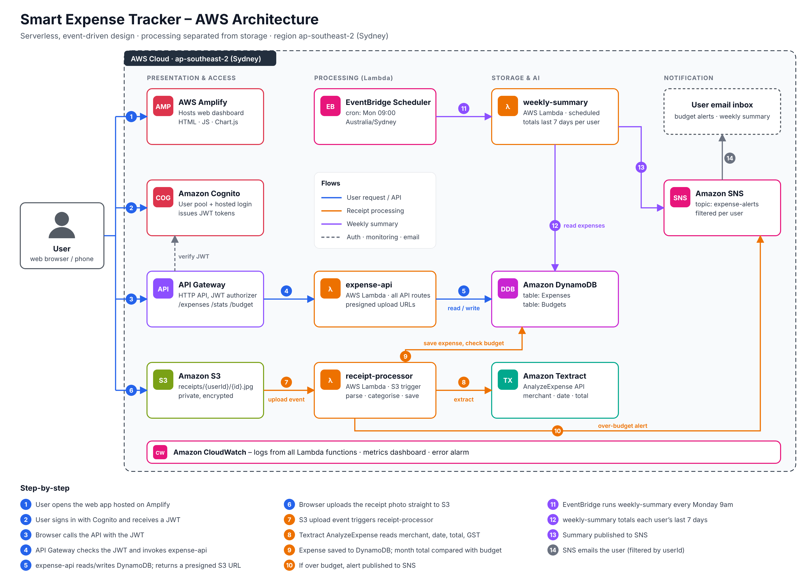
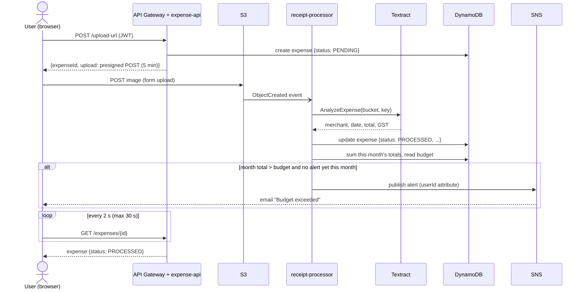

# Phase 1 – Software Design / Architecture
**ICT5205 Cloud Computing – Assignment 3 · Smart Expense Tracker**

Status: DESIGN ONLY – nothing deployed. This document replaces the draft data design in `Phase0_Decisions.md`.
Most of it can be copied into the report's **Software Design/Architecture** section.

---

## 1. Architecture diagram



Source: `images/architecture.svg` (editable) · regenerate with `diagram_src/architecture.py`.

### Why this counts as a distributed architecture (rubric: 3/3)

| Rubric requirement | Our design |
|---|---|
| Separate processing and storage components | Processing: 3 Lambda functions + Textract. Storage: S3 (images) + DynamoDB (records). They scale and fail independently. |
| + one more distributed pattern | **Event-driven / publish–subscribe:** S3 upload events trigger processing asynchronously; SNS publishes alerts to subscribed users (filter per user). **Scheduled processing:** EventBridge Scheduler runs a batch job weekly. **Multiple REST endpoints** behind API Gateway. |
| Cloud deployment of client | Web dashboard hosted on AWS Amplify |

---

## 2. Components and their purpose

| # | Service | Resource name | Purpose | Key settings |
|---|---|---|---|---|
| 1 | AWS Amplify Hosting | `expense-tracker-web` | Host the static web dashboard | Manual deploy (zip upload) or GitHub-connected |
| 2 | Amazon Cognito | User pool `expense-tracker-users`, app client `web` | Sign-up / sign-in, issues JWT | Email as username, managed login page, callback = Amplify URL |
| 3 | Amazon API Gateway | HTTP API `expense-tracker-api` | Public REST endpoint | JWT authorizer (Cognito), CORS for Amplify domain |
| 4 | AWS Lambda | `expense-api` | All API routes | Python 3.12, 256 MB, 10 s timeout |
| 5 | AWS Lambda | `receipt-processor` | Process uploaded receipts | Python 3.12, 512 MB, 30 s timeout, S3 trigger |
| 6 | AWS Lambda | `weekly-summary` | Weekly email per user | Python 3.12, 256 MB, 60 s timeout |
| 7 | Amazon S3 | `expense-tracker-receipts-<group>` | Store receipt images | Block all public access, SSE-S3 encryption, CORS (POST/GET from Amplify domain) |
| 8 | Amazon Textract | AnalyzeExpense API | Extract merchant, date, total, GST | Synchronous call on S3 object |
| 9 | Amazon DynamoDB | `Expenses`, `Budgets` | Store records | On-demand capacity |
| 10 | Amazon SNS | Topic `expense-alerts` | Email alerts + weekly summary | One email subscription per user with filter policy on `userId` |
| 11 | Amazon EventBridge Scheduler | `weekly-summary-schedule` | Trigger weekly job | `cron(0 9 ? * MON *)`, timezone `Australia/Sydney` |
| 12 | Amazon CloudWatch | Log groups, dashboard `ExpenseTracker`, alarm `lambda-errors` | Monitoring | Alarm when any Lambda `Errors` ≥ 1 in 5 min → admin email |

That gives **10 distinct services** (Lambda counted once).

---

## 3. Data flows

### Flow A – Upload a receipt (main flow)



### Flow B – View dashboard
1. Browser calls `GET /expenses?month=2026-10` and `GET /stats`.
2. `expense-api` queries DynamoDB by `userId` and returns rows + totals.
3. Browser renders the table and Chart.js charts (pie by category, bar by month).

### Flow C – Set budget
1. User enters monthly limit and email → `PUT /budget`.
2. `expense-api` saves to `Budgets` table and, if the email is new, calls `sns:Subscribe` with filter policy `{"userId": ["<id>"]}`.
3. SNS sends a confirmation email – the user must click **Confirm subscription**.

### Flow D – Weekly summary
1. EventBridge Scheduler invokes `weekly-summary` every Monday 9:00 Sydney time.
2. Lambda scans `Budgets` (users with alerts on), queries each user's last 7 days in `Expenses`.
3. Publishes one message per user to SNS with `userId` attribute → user gets email.

---

## 4. Data design

### 4.1 DynamoDB table `Expenses`

| Attribute | Type | Key | Example | Notes |
|---|---|---|---|---|
| `userId` | S | Partition key | `3f1c…` | Cognito `sub` |
| `expenseId` | S | Sort key | `01J9Z…` | ULID/UUID created by `expense-api` |
| `status` | S | | `PENDING` / `PROCESSED` / `FAILED` | |
| `merchant` | S | | `Coles Supermarkets Australia Pty Ltd` | Textract `VENDOR_NAME` |
| `receiptDate` | S | | `2024-11-04` | ISO, parsed **day-first** from `04/11/2024` |
| `total` | N | | `40.00` | Textract `TOTAL` (fallback `AMOUNT_PAID`) |
| `gst` | N | | `0.38` | Textract `TAX` (optional) |
| `category` | S | | `Groceries` | Rule-based, user can edit |
| `imageKey` | S | | `receipts/3f1c…/01J9Z….jpg` | |
| `confidence` | N | | `97.5` | Lowest confidence of the 3 main fields |
| `createdAt` | S | | `2026-10-10T01:04:00Z` | |
| `errorMessage` | S | | `No total found` | only if FAILED |

**Access patterns**

| Need | How |
|---|---|
| List a user's expenses | `Query userId = :u` |
| One expense | `GetItem userId, expenseId` |
| This month's total | `Query userId = :u`, filter `receiptDate begins_with "2026-10"` and `status = PROCESSED`, sum in Lambda |
| Weekly summary | Same query with `receiptDate >= today-7` |

At student scale (hundreds of items per user) a query + filter is fine. A GSI on `userId + receiptDate` is the scale-up option (mention in reflection).

### 4.2 DynamoDB table `Budgets`

| Attribute | Type | Key | Example |
|---|---|---|---|
| `userId` | S | Partition key | `3f1c…` |
| `monthlyLimit` | N | | `500` |
| `email` | S | | `student@example.com` |
| `subscriptionArn` | S | | SNS subscription ARN |
| `weeklySummary` | BOOL | | `true` |
| `lastAlertMonth` | S | | `2026-10` – stops repeated alerts in the same month |

### 4.3 S3 bucket `expense-tracker-receipts-<group>`

```
receipts/
  <userId>/
    <expenseId>.jpg        ← uploaded by browser via presigned POST
```
- Accepts JPEG/PNG, **max 5 MB** – checked in the browser and enforced by the presigned POST policy (`content-length-range`, `Content-Type` starts with `image/`).
- Block Public Access: ON. Images viewed through short-lived presigned GET URLs.
- Event notification: `s3:ObjectCreated:*`, prefix `receipts/` → `receipt-processor`.
- CORS: allow `POST`, `GET` from the Amplify domain (and `http://localhost:5500` for local testing).

### 4.4 Category rules (in `receipt-processor`)

| Category | Merchant contains (case-insensitive) |
|---|---|
| Groceries | coles, woolworths, aldi, iga, harris farm, costco |
| Dining | mcdonald, kfc, hungry jack, subway, domino, cafe, coffee, restaurant, uber eats |
| Transport | shell, bp, ampol, 7-eleven, caltex, uber, opal, myki |
| Shopping | kmart, target, big w, bunnings, jb hi-fi, officeworks, amazon |
| Health | chemist warehouse, priceline, pharmacy, medical |
| Other | anything else |

---

## 5. API design (API Gateway HTTP API → `expense-api`)

All routes require header `Authorization: Bearer <Cognito ID token>`. `userId` always comes from the token (`sub` claim), never from the request body.

| Method | Route | Request | Response (200) |
|---|---|---|---|
| POST | `/upload-url` | `{"contentType":"image/jpeg"}` | `{"expenseId":"01J9Z…","upload":{"url":"https://…","fields":{…}},"expiresIn":300}` |
| GET | `/expenses?month=YYYY-MM` | – | `{"items":[{expense}, …]}` |
| GET | `/expenses/{id}` | – | `{expense, "imageUrl":"<presigned GET>"}` |
| PUT | `/expenses/{id}` | `{"category":"Dining","total":12.5,"merchant":"…","receiptDate":"2026-10-01"}` (any subset) | updated expense |
| DELETE | `/expenses/{id}` | – | `{"deleted":true}` (also deletes S3 image) |
| GET | `/stats?months=6` | – | `{"byCategory":{"Groceries":120.4,…},"byMonth":{"2026-09":310.2,…},"thisMonth":{"total":180.0,"budget":500,"remaining":320.0}}` |
| GET | `/budget` | – | `{"monthlyLimit":500,"email":"…","weeklySummary":true,"subscriptionStatus":"confirmed"}` |
| PUT | `/budget` | `{"monthlyLimit":500,"email":"…","weeklySummary":true}` | saved budget |

Errors: `400` bad input · `401` missing/invalid token (from API Gateway) · `404` not found · `500` server error. Body `{"error":"message"}`.

---

## 6. Lambda functions

### 6.1 `expense-api`
- **Trigger:** API Gateway (payload v2.0).
- **Env vars:** `EXPENSES_TABLE`, `BUDGETS_TABLE`, `BUCKET`, `TOPIC_ARN`.
- **Logic:** route on `routeKey`, read `userId` from `requestContext.authorizer.jwt.claims.sub`, validate input, call DynamoDB/S3/SNS.
- **IAM permissions:** DynamoDB `GetItem/PutItem/UpdateItem/DeleteItem/Query` on both tables; S3 `PutObject/GetObject/DeleteObject` on `receipts/*`; SNS `Subscribe/Unsubscribe/GetSubscriptionAttributes`; CloudWatch Logs.

### 6.2 `receipt-processor`
- **Trigger:** S3 `ObjectCreated` on `receipts/`.
- **Env vars:** `EXPENSES_TABLE`, `BUDGETS_TABLE`, `TOPIC_ARN`.
- **Steps:**
  1. Read `userId`, `expenseId` from the object key.
  2. `textract.analyze_expense(Document={"S3Object":{...}})`.
  3. Pick `VENDOR_NAME`, `INVOICE_RECEIPT_DATE`, `TOTAL` (fallback `AMOUNT_PAID`), `TAX`.
  4. Clean values: strip `$`/commas → number; parse date **DD/MM/YYYY first**, then other formats; if no date use upload date.
  5. Assign category (section 4.4).
  6. Update item → `PROCESSED` (or `FAILED` + `errorMessage` if no total).
  7. Sum this month; if over `monthlyLimit` and `lastAlertMonth` ≠ this month → publish to SNS with `MessageAttributes={"userId":…}` and set `lastAlertMonth`.
- **IAM:** S3 `GetObject`; Textract `AnalyzeExpense`; DynamoDB `GetItem/UpdateItem/Query`; SNS `Publish`; CloudWatch Logs.

### 6.3 `weekly-summary`
- **Trigger:** EventBridge Scheduler.
- **Steps:** scan `Budgets` where `weeklySummary = true` → for each user query last 7 days → build text (total, top category, budget used %) → SNS publish with `userId` attribute.
- **IAM:** DynamoDB `Scan` (Budgets), `Query` (Expenses); SNS `Publish`; CloudWatch Logs.

---

## 7. Security design

| Area | Measure |
|---|---|
| Authentication | Cognito user pool; API Gateway JWT authorizer rejects requests without a valid token |
| Authorisation | Every DynamoDB key and S3 key uses `userId` from the token → users can only see their own data |
| Storage | S3 private (Block Public Access), SSE-S3 encryption; DynamoDB encrypted at rest by default |
| Uploads | Presigned POST expires in 5 min, fixed to one key, image content types only, 5 MB max |
| Least privilege | Separate IAM role per Lambda with only the actions listed in section 6 |
| Secrets | No AWS keys in code or GitHub; Lambdas use IAM roles; config via environment variables |
| Account | Budget alert ($15); root MFA + IAM users before Phase 3 |
| Privacy | All data stays in Sydney region (Australian Privacy Act); user can delete expenses and images |

---

## 8. Front-end design (Amplify-hosted, HTML + JS + Chart.js)

```
┌───────────────────────────────────────────────────────────────┐
│ Smart Expense Tracker                    user@email  [Logout] │
├───────────────────────────────────────────────────────────────┤
│ ┌───────────┐ ┌───────────┐ ┌───────────┐ ┌────────────────┐  │
│ │This month │ │ Budget    │ │ Remaining │ │ Receipts       │  │
│ │ $180.00   │ │ $500.00   │ │ $320.00   │ │ 12             │  │
│ └───────────┘ └───────────┘ └───────────┘ └────────────────┘  │
│ [ Upload receipt ]  ← choose photo → "Processing…" → done      │
│                                                               │
│ ┌──── Spending by category ────┐ ┌──── Spending by month ───┐ │
│ │        (pie chart)           │ │       (bar chart)        │ │
│ └──────────────────────────────┘ └──────────────────────────┘ │
│                                                               │
│ Expenses  [Month: Oct 2026 ▼]                                 │
│ Date       Merchant        Category   Total   GST   Actions   │
│ 04/11/24   Coles           Groceries  $40.00  $0.38 View Edit Del │
│ …                                                             │
├───────────────────────────────────────────────────────────────┤
│ Settings: Monthly budget [ 500 ]  Email [ … ]  ☑ Weekly email │
└───────────────────────────────────────────────────────────────┘
```

Pages / files:
| File | Purpose |
|---|---|
| `index.html` | Landing page with **Sign in** button (redirects to Cognito managed login) |
| `dashboard.html` | Summary cards, upload, charts, table, settings |
| `config.js` | API URL, Cognito domain, client ID, redirect URL |
| `auth.js` | Read tokens returned from Cognito, store in `sessionStorage`, logout |
| `api.js` | `fetch` wrapper adding `Authorization` header |
| `app.js` | Upload flow, polling, rendering table and charts |
| `styles.css` | Styling |

Dates shown in Australian format (DD/MM/YYYY), currency AUD.

---

## 9. Monitoring design (CloudWatch)

| Item | Detail |
|---|---|
| Logs | One log group per Lambda (automatic), retention 14 days |
| Dashboard `ExpenseTracker` | Lambda invocations, errors, duration (3 functions); API Gateway 4xx/5xx and latency; DynamoDB consumed capacity |
| Alarm `lambda-errors` | Sum of `Errors` ≥ 1 in 5 min → SNS admin email |
| Structured logs | Each Lambda logs JSON: `{"event":"receipt_processed","expenseId":…,"ms":…}` |

---

## 10. Design decisions and trade-offs (use in report + reflection)

| Decision | Alternative | Why we chose it | Trade-off |
|---|---|---|---|
| Serverless (Lambda) | EC2 server | Scales automatically, no server to manage, near-$0 when idle | Cold starts (~1 s), 15-min limit |
| Browser uploads straight to S3 (presigned POST) | Upload through API Gateway | API Gateway payload limit (10 MB) and Lambda cost avoided; faster | Slightly more complex front end |
| Async processing via S3 event | Process inside the API call | User gets an instant response; processing scales independently | Front end must poll for the result |
| DynamoDB | RDS MySQL | Serverless, free tier, no instance running 24/7 (we saw RDS cost $3.91 in 8 days) | No SQL joins; aggregation done in Lambda |
| Textract AnalyzeExpense | Train own OCR model | Accurate on receipts out of the box, no training data | Cost per page after free tier |
| Rule-based categories | ML classifier / Amazon Comprehend | Simple, explainable, editable | Unknown merchants → "Other" |
| SNS with filter policies | Amazon SES | Simple pub/sub, no domain verification | Plain-text emails, user must confirm subscription |
| HTTP API | REST API | Cheaper, built-in JWT authorizer, simple CORS | Fewer features (no usage plans) |
| Sydney region | N. Virginia | Lower latency for Australian users, data residency | Slightly higher price |

---

## 11. Naming and configuration (fill in during Phase 3)

| Setting | Value |
|---|---|
| Region | `ap-southeast-2` |
| Bucket | `expense-tracker-receipts-<group>` |
| Cognito user pool ID | `ap-southeast-2_xxxxxxxx` |
| Cognito app client ID | |
| Cognito domain | `https://<prefix>.auth.ap-southeast-2.amazoncognito.com` |
| API URL | `https://<id>.execute-api.ap-southeast-2.amazonaws.com` |
| SNS topic ARN | |
| Amplify URL | `https://main.<id>.amplifyapp.com` |

---

## 12. Phase 1 checklist

- [x] Architecture diagram (`images/architecture.png`)
- [x] Component list with purpose and settings
- [x] Data flows (upload, dashboard, budget, weekly summary)
- [x] DynamoDB tables, S3 layout, category rules
- [x] API routes with request/response
- [x] Lambda responsibilities and IAM permissions
- [x] Security, front-end, monitoring design
- [x] Design decisions and trade-offs
- [ ] Team reviews this document (everyone should understand the diagram – the examiner will ask)
- [ ] Tutor sees the architecture diagram (optional but useful)

Next: **Phase 2 – Prepare code locally** (repo structure, Lambda code, front end, local tests). Still nothing deployed.
