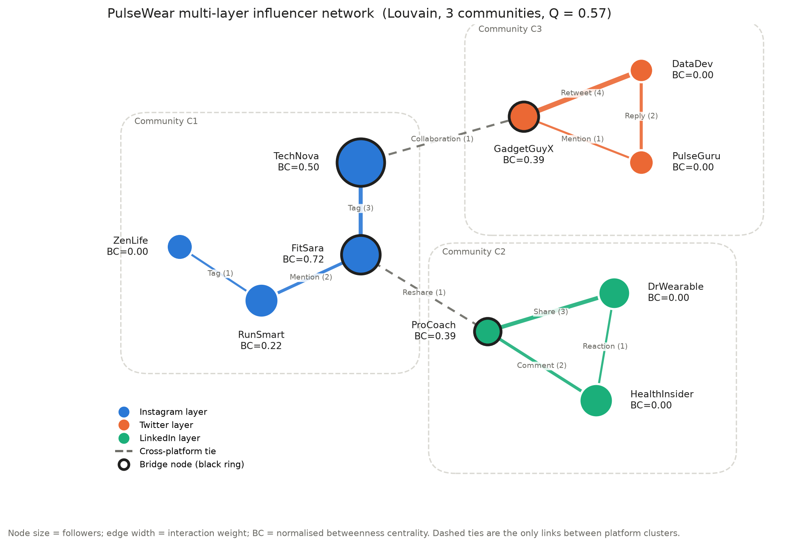
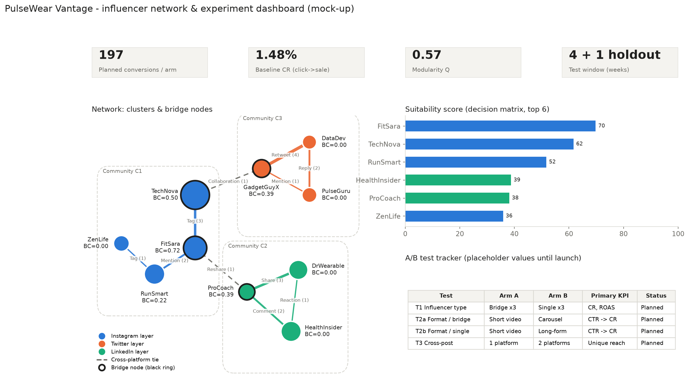
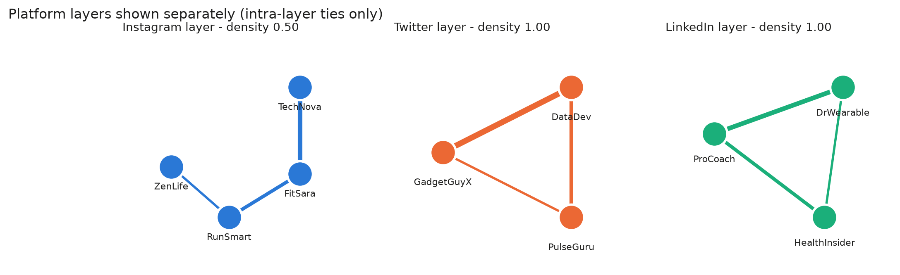
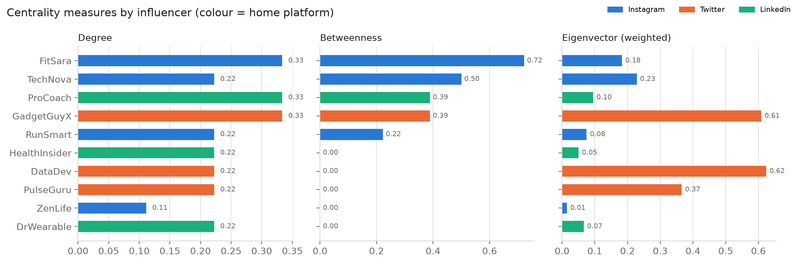
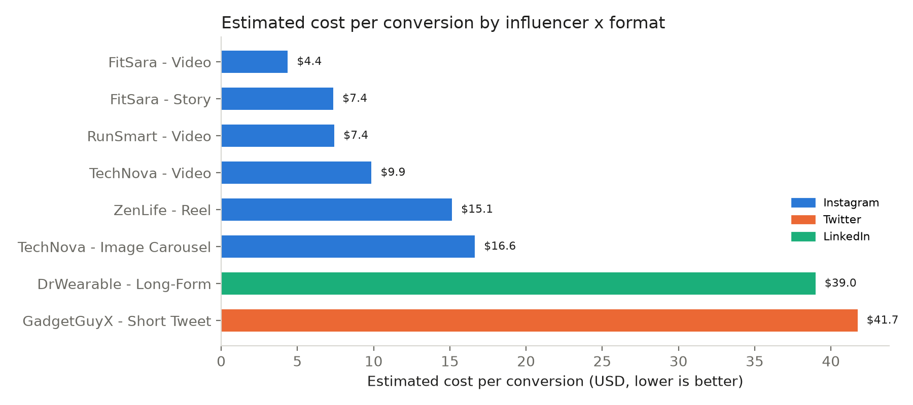
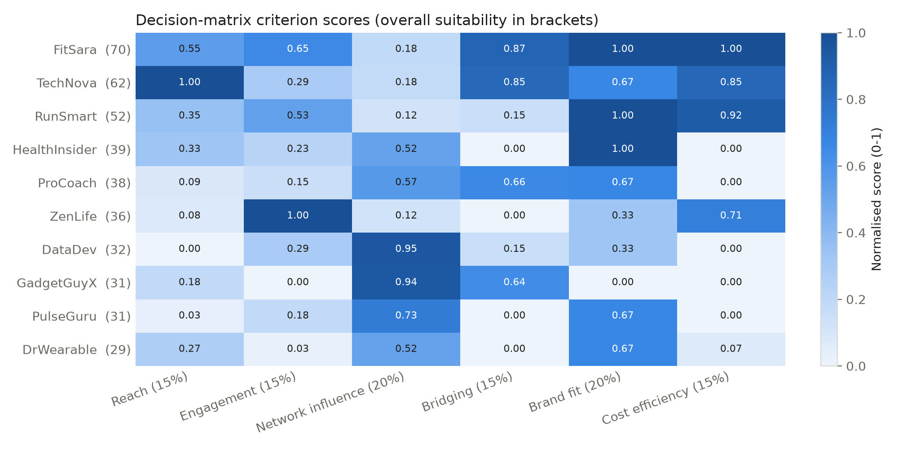
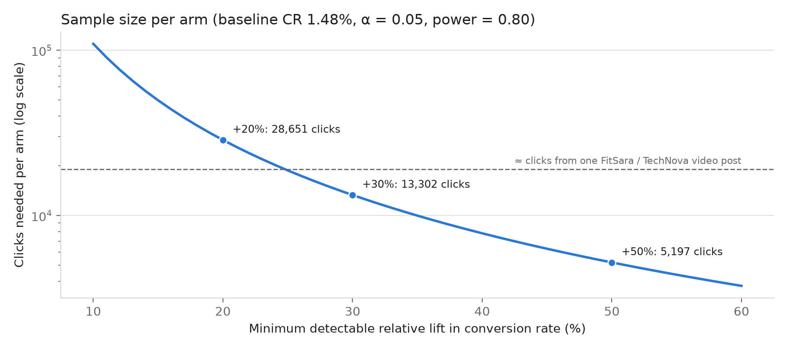

# PulseWear Vantage: Influencer Network Analysis and Multi-Layer A/B Testing Strategy

MIS5308 Social and Web Analytics – Assessment 1, Week 3 PBL | Student name: [Your name] | Student ID: [Your ID]

## 1. Network analysis: where engagement gets stuck

The 11 interactions were modelled as a multi-layer network (Kivelä et al., 2014), with one layer each for Instagram, Twitter/X and LinkedIn and two inter-layer "Cross" ties (Figure 1). Edges are weighted by interaction intensity (1–4). Degree, betweenness (Freeman, 1977) and weighted eigenvector centrality (Bonacich, 1987) were calculated, and audience segments were detected with Louvain modularity optimisation (Blondel et al., 2008). Full metrics are in Appendix A.

{w=560}

**Finding 1: fragmentation is structural.** Louvain returns three communities that match the three platforms exactly, with strong separation (Q = 0.57; values above 0.3 indicate clear community structure, Newman, 2006). The Twitter/X and LinkedIn layers are closed triangles (density = 1.0), so content recirculates among the same audiences. Only two weak ties (weight = 1) connect the clusters. This explains why mentions rise while conversions do not: the campaign is amplified *within* silos, not *across* them.

**Finding 2: a few bridges control cross-platform flow.** FitSara has the highest betweenness (0.72) and the lowest Burt constraint (0.33), making it the main structural-hole broker (Burt, 1992) and the only Instagram→LinkedIn path. TechNova (0.50) is the only Instagram→Twitter gateway; GadgetGuyX and ProCoach (0.39 each) are the receiving ends. Removing any of these nodes disconnects a platform.

**Finding 3: high eigenvector is not the same as influence.** DataDev has the highest eigenvector score (0.62) but zero betweenness, because its score comes from a strong Retweet tie inside a closed triangle. Selecting on eigenvector alone would over-invest in an echo chamber.

## 2. Influencer suitability and decision matrix

Each influencer was scored on six min–max normalised criteria (Table 1; full matrix in Appendix B). Brand fit was judged against an assumed PulseWear identity (innovative, health and performance focused, credible, premium), because no guidelines were supplied. ROI was proxied by cost per conversion = cost per post ÷ (followers × CTR × conversion rate).

**Table 1. Decision matrix summary (weights: reach 15%, engagement 15%, network influence 20%, bridging 15%, brand fit 20%, cost efficiency 15%)**

| Influencer | Role in network | Brand fit (1–5) | Best cost / conversion | Score /100 | Decision |
|---|---|---|---|---|---|
| FitSara | Primary bridge (BC 0.72) | 5 – motivational fitness | $4.4 (video) | **70** | Priority |
| TechNova | Instagram→Twitter gateway, 520k reach | 4 – energetic tech reviews | $9.9 (video) | **62** | Priority |
| RunSmart | Deepens Instagram cluster | 5 – running use case | $7.4 (video) | **52** | Priority |
| HealthInsider | Largest LinkedIn reach (210k) | 5 – health tech | Untested | **39** | Secondary (pilot) |
| ProCoach | LinkedIn landing bridge (BC 0.39) | 4 – professional wellness | Untested | **38** | Secondary (pilot) |
| GadgetGuyX | Twitter bridge (BC 0.39) | 2 – humorous tone | $41.7 (tweet) | 31 | Not now |

The top three stay in the same order under three alternative weightings (Appendix B), so the priority tier is robust. FitSara and TechNova combine bridging with the lowest acquisition costs. RunSmart adds cost-efficient depth rather than reach. ProCoach and HealthInsider are recommended as secondary because they activate LinkedIn, but they have no campaign history, so they enter through a pilot. GadgetGuyX is structurally useful but costs 9.5× more per conversion than FitSara and carries tone risk.

## 3. Multi-layer A/B testing blueprint

**Table 2. Experimental design**

| Element | Design |
|---|---|
| Primary hypothesis (H1) | Bridge influencers (FitSara, TechNova, ProCoach) achieve a higher conversion rate and ROAS than single-cluster influencers (RunSmart, HealthInsider, ZenLife). H0: no difference. |
| Secondary hypotheses | H2: short-form video converts better than carousel or long-form. H3: cross-posting along a bridge pair adds unique reach. H4: the format effect differs by influencer type. |
| Structure | Layer 1: bridge vs single-cluster arms (parallel). Layer 2: format tests nested within each influencer (video vs carousel; video vs long-form). Layer 3: landing-page A/B, randomised per click. |
| Sample size | Two-proportion formula (Kohavi et al., 2020): 13,302 clicks per arm to detect a +30% lift from the 1.48% baseline (Appendix C). |
| Significance and analysis | α = 0.05, power = 0.80, Holm correction across H1–H4; mixed-effects logistic regression with influencer and post random effects. |
| Test length | 4 weeks (full weekly cycles) + 1-week hold-out for lagged purchases; at least 8 posts per influencer; no early stopping. |
| Randomisation | Stratified by platform and follower band; posting slots and format order assigned by a seeded random generator, logged before launch by an analyst independent of influencer selection. |
| Controls | Same posting window, hashtags, 10% offer, CTA and product claims; no paid boosting; linked bridge pairs post in different weeks to limit spillover. |

The number of clicks is not the constraint: one FitSara or TechNova video already produces about 19,000 clicks. The real limit is having only three influencers per arm, so the analysis models the clustering and reports effect sizes with confidence intervals rather than relying on a single p-value.

## 4. Dashboard, risks and strategic rationale

{w=560}

**Table 3. Key risks and mitigations (full analysis in Appendix D)**

| Risk | Mitigation built into the design |
|---|---|
| Audience fatigue in the Instagram chain | Frequency caps, staggered posting weeks, fatigue KPI on the dashboard |
| Algorithm changes reduce reach | Three-platform spread; judge success on conversion per click, not raw reach |
| Influencer scandal or dependence on one bridge | Brand-safety vetting and morals clause; no influencer above 35% of budget; secondary tier on standby |
| Non-disclosure and privacy breaches | #ad labelling (ACCC, 2023); consent-based tracking and aggregated data under the Privacy Act 1988 (Cth) |

**Rationale.** PulseWear's conversion problem is structural rather than a product problem. Engagement circulates inside three platform silos that are joined by two weak ties, so adding reach inside a silo mostly re-reaches the same people. Budget should move to bridge activation: FitSara and TechNova on Instagram video, paired with ProCoach to open LinkedIn. The cost data supports the same choice, since brand-aligned Instagram video converts 5–9× more cheaply than Twitter/X or LinkedIn text formats. The A/B design turns this into evidence within five weeks, while its controls separate the influencer effect from format, timing and offer. The main risks all come from concentration, and the design diversifies and monitors each one.

<!-- pagebreak -->

## References

Australian Competition and Consumer Commission. (2023). *Social media influencers: A guide for influencers on disclosing advertising*. https://www.accc.gov.au

Blondel, V. D., Guillaume, J.-L., Lambiotte, R., & Lefebvre, E. (2008). Fast unfolding of communities in large networks. *Journal of Statistical Mechanics: Theory and Experiment, 2008*(10), P10008. https://doi.org/10.1088/1742-5468/2008/10/P10008

Bonacich, P. (1987). Power and centrality: A family of measures. *American Journal of Sociology, 92*(5), 1170–1182. https://doi.org/10.1086/228631

Burt, R. S. (1992). *Structural holes: The social structure of competition*. Harvard University Press.

Freeman, L. C. (1977). A set of measures of centrality based on betweenness. *Sociometry, 40*(1), 35–41. https://doi.org/10.2307/3033543

Guimerà, R., & Amaral, L. A. N. (2005). Functional cartography of complex metabolic networks. *Nature, 433*(7028), 895–900. https://doi.org/10.1038/nature03288

Kivelä, M., Arenas, A., Barthelemy, M., Gleeson, J. P., Moreno, Y., & Porter, M. A. (2014). Multilayer networks. *Journal of Complex Networks, 2*(3), 203–271. https://doi.org/10.1093/comnet/cnu016

Kohavi, R., Tang, D., & Xu, Y. (2020). *Trustworthy online controlled experiments: A practical guide to A/B testing*. Cambridge University Press. https://doi.org/10.1017/9781108653985

Newman, M. E. J. (2006). Modularity and community structure in networks. *Proceedings of the National Academy of Sciences, 103*(23), 8577–8582. https://doi.org/10.1073/pnas.0601602103

<!-- pagebreak -->

## Appendix A. Network metrics

All values come from the analysis notebook (`week3_analysis.ipynb`). The graph is undirected and weighted; weighted betweenness uses distance = 1/weight; PageRank uses the directed graph.

**Table A1. Node-level metrics**

| Influencer | Platform | Comm. | Deg. | Betw. | Eigen. | PageRank | Constr. | Partic. | Cut node |
|---|---|---|---|---|---|---|---|---|---|
| FitSara | Instagram | C1 | 3 | 0.72 | 0.18 | 0.03 | 0.33 | 0.28 | Yes |
| TechNova | Instagram | C1 | 2 | 0.50 | 0.23 | 0.02 | 0.50 | 0.38 | Yes |
| GadgetGuyX | Twitter | C3 | 3 | 0.39 | 0.61 | 0.14 | 0.61 | 0.28 | Yes |
| ProCoach | LinkedIn | C2 | 3 | 0.39 | 0.10 | 0.15 | 0.61 | 0.28 | Yes |
| RunSmart | Instagram | C1 | 2 | 0.22 | 0.08 | 0.04 | 0.50 | 0.00 | Yes |
| DataDev | Twitter | C3 | 2 | 0.00 | 0.62 | 0.14 | 1.01 | 0.00 | No |
| PulseGuru | Twitter | C3 | 2 | 0.00 | 0.37 | 0.14 | 1.01 | 0.00 | No |
| HealthInsider | LinkedIn | C2 | 2 | 0.00 | 0.05 | 0.15 | 1.01 | 0.00 | No |
| DrWearable | LinkedIn | C2 | 2 | 0.00 | 0.07 | 0.15 | 1.01 | 0.00 | No |
| ZenLife | Instagram | C1 | 1 | 0.00 | 0.01 | 0.05 | 1.00 | 0.00 | No |

Comm. = Louvain community; Deg. = degree; Betw. = normalised betweenness; Eigen. = weighted eigenvector; Constr. = Burt's constraint (lower = more brokerage); Partic. = participation coefficient (Guimerà & Amaral, 2005), the share of an influencer's tie weight that falls outside their own community; Cut node = articulation point, whose removal disconnects the network.

{w=600}

{w=600}

## Appendix B. Decision matrix detail

**Scoring method.** Each criterion was min–max normalised to 0–1 and weighted:

- Reach 15%: followers
- Engagement 15%: engagement rate
- Network influence 20%: mean of eigenvector and PageRank
- Bridging 15%: mean of weighted betweenness and participation coefficient
- Brand fit 20%: judgement score, 1–5
- Cost efficiency 15%: inverted cost per conversion

Influencers without campaign data were scored as the least cost-efficient. This is a conservative choice that biases against untested influencers, which is why the secondary tier is piloted rather than excluded.

**Table A2. Full decision matrix**

| Influencer | Reach | Engagement | Network influence | Bridging | Brand fit | Cost efficiency | Score /100 |
|---|---|---|---|---|---|---|---|
| FitSara | .55 | .65 | .18 | .87 | 1.00 | 1.00 | 70 |
| TechNova | 1.00 | .29 | .18 | .85 | .67 | .85 | 62 |
| RunSmart | .36 | .53 | .12 | .15 | 1.00 | .92 | 52 |
| HealthInsider | .33 | .23 | .52 | .00 | 1.00 | .00 | 39 |
| ProCoach | .09 | .15 | .57 | .66 | .67 | .00 | 38 |
| ZenLife | .08 | 1.00 | .12 | .00 | .33 | .71 | 36 |
| DataDev | .00 | .29 | .95 | .15 | .33 | .00 | 32 |
| GadgetGuyX | .18 | .00 | .94 | .64 | .00 | .00 | 31 |
| PulseGuru | .03 | .18 | .73 | .00 | .67 | .00 | 31 |
| DrWearable | .27 | .03 | .52 | .00 | .67 | .07 | 29 |

**Sensitivity analysis.** Three alternative weightings were tested:

- brand fit 30% with network influence 10%
- bridging 25% with reach and engagement at 10% each
- reach 25%

FitSara, TechNova and RunSmart stay first to third in all three. Only the secondary slots change: GadgetGuyX enters the top five when bridging is weighted most heavily.

{w=560}

{w=600}

## Appendix C. A/B test statistics

**Sample size formula (two proportions).**

`n = [z(1−α/2)·√(2p̄(1−p̄)) + z(1−β)·√(p1(1−p1) + p2(1−p2))]² / (p2 − p1)²`

The baseline p1 = 1.48% is the pooled click-to-purchase rate across current campaigns; α = 0.05 (two-sided) and power = 0.80.

**Table A3. Clicks needed per arm**

| Minimum detectable lift | Independent clicks | With clustering (ICC = 0.01, ~2,000 clicks per post, design effect ≈ 21) |
|---|---|---|
| +20% | 28,651 | ≈ 601,000 |
| +30% (recommended) | 13,302 | ≈ 279,000 |
| +50% | 5,197 | ≈ 109,000 |

**Analysis model.** `purchase ~ influencer_type * format + (1 | influencer) + (1 | post)`

The model is fitted as a mixed-effects logistic regression. Results are reported as odds ratios with 95% confidence intervals, and the Holm–Bonferroni correction is applied across H1–H4. Early stopping is allowed only at a pre-registered O'Brien–Fleming boundary.

**Controls and covariates.** The following are held constant across arms:

- posting window (weekdays 18:00–20:00, audience local time)
- the hashtag set (#PulseWearVantage, #TrackYourPulse)
- the 10% discount (the codes differ only for tracking)
- CTA wording, product claims and video length (under 45 seconds)

The model adjusts for follower count, historical engagement rate and audience overlap. Cross-exposed users are identified by discount code and cookie and excluded from the H1 estimate.

{w=560}

## Appendix D. Full risk–benefit analysis

**Table A4. Risk register**

| Risk | Likelihood / impact | Mitigation |
|---|---|---|
| Audience fatigue: the Instagram cluster is a chain, so the same followers repeatedly see FitSara, TechNova and RunSmart | High / Medium | Frequency cap; staggered posting weeks; track frequency and conversion decay; rotate formats |
| Algorithm changes throttle reach (e.g., Reels or link posts) | Medium / High | Spread across three platforms; measure conversion per click; keep a hold-out control |
| Influencer scandal or off-brand behaviour | Low / High | Morals clause; 12-month brand-safety review of past posts; budget cap of 35% per influencer; secondary tier on standby |
| Over-reliance on bridges: both cross-ties are weak (weight 1), and removing FitSara disconnects LinkedIn | Medium / High | Develop more bridges through briefed cross-platform collaborations; monitor bridge strength monthly |
| False positives from a small sample (six influencers) | High / Medium | Mixed model, pre-registration, Holm correction, effect sizes with intervals |
| Legal and ethical exposure: undisclosed ads, or tracking without consent | Medium / High | #ad and paid-partnership labels (ACCC, 2023); consent-based cookies; aggregated, anonymised analytics under the Privacy Act 1988 (Cth) and GDPR |
| Data limitations: a 10-node sample; CTR and conversion-rate definitions assumed; brand fit is a judgement | High / Medium | State assumptions; run sensitivity analysis; validate through the pilot before scaling |
