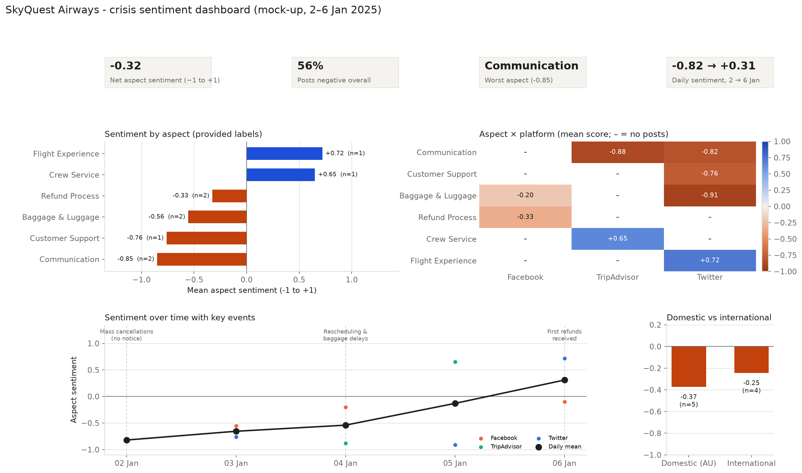
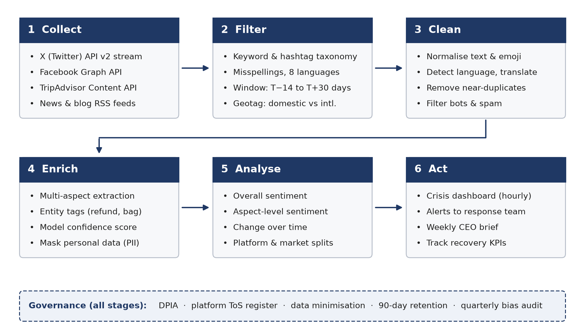
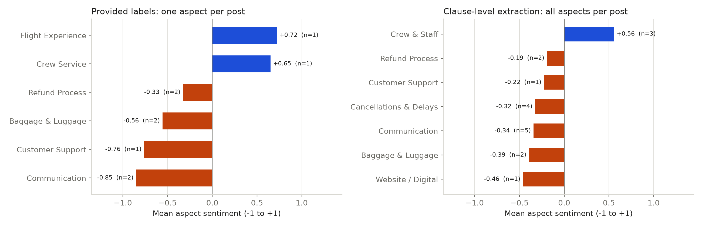
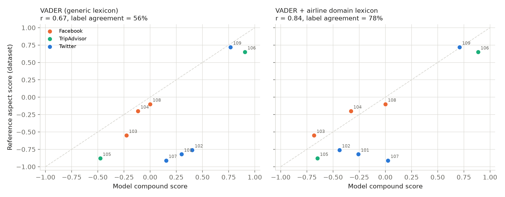
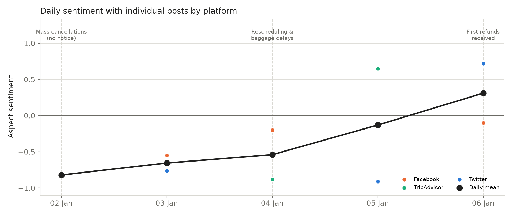
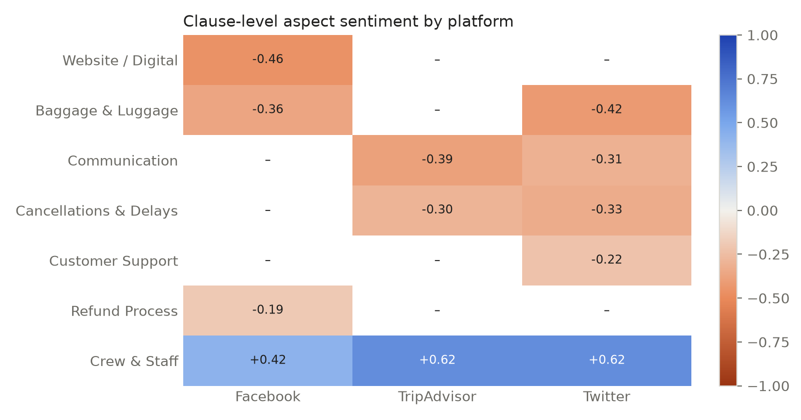

# SkyQuest Airways: Crisis Sentiment Analytics and Reputation Recovery

MIS5308 Social and Web Analytics – Assessment 1, Week 5 PBL | Student name: [Your name] | Student ID: [Your ID]

## Strategic brief for the CEO

**Situation.** Holiday-peak cancellations (2–6 January 2025) triggered a backlash on Twitter/X, Facebook and TripAdvisor: net aspect sentiment is **−0.32**, and 56% of posts are negative.

**Data strategy.** API-first collection from X, Facebook, TripAdvisor and news RSS. Posts are filtered by a multilingual taxonomy across a before, during and after window, split by market, and analysed at three levels: overall, by aspect and over time. A Data Protection Impact Assessment (DPIA) governs the pipeline.

**Findings.**

- **The problem is communication, not the cancellation itself.** Communication is the most negative (−0.85) and most frequent aspect (5 of 18 mentions): "no warning", "nobody told us".
- **The recovery journey is failing too.** Support (−0.76), baggage (−0.56) and refunds (−0.33) are negative.
- **Staff are the strongest asset.** Crew and staff are the only positive aspect (+0.56), praised on all three platforms.
- **Sentiment is turning.** The daily mean rose from −0.82 to +0.31 as refunds arrived. Twitter/X (−0.44) and domestic customers (−0.37) are the most negative.

**Table 1. Three actions for the next 30 days**

| Action | Evidence | 30-day plan | KPI |
|---|---|---|---|
| 1. Proactive disruption alerts | Communication −0.85 on all platforms | Weeks 1–2: SMS, email and app alerts sent automatically within 30 minutes of a cancellation. Weeks 3–4: live status page | Communication sentiment above −0.30 |
| 2. Fix refunds and baggage | Refunds −0.33, baggage −0.56, site crashes | Week 1: refund surge team. Week 2: refund tracker and extra website capacity. Weeks 3–4: baggage-status updates | Refunds paid within 7 days |
| 3. Staff-led apology and goodwill | Crew the only positive aspect | Week 1: CEO apology crediting staff (a rebuild strategy; Coombs, 2007). Weeks 2–4: staff goodwill vouchers; reply to every TripAdvisor review | Net sentiment above 0 |

## 1. Data collection architecture

**Table 2. Collection plan** (pipeline in Appendix A, Figure A1; full platform detail in Table A1)

| Platform | Access | Constraint and compliance |
|---|---|---|
| Twitter/X (social) | API v2 filtered stream | Paid tier, OAuth 2.0, monthly caps; the Developer Agreement bans scraping |
| Facebook (social) | Graph API, SkyQuest Page | Page token, app review, hourly limits; public comments only |
| TripAdvisor (reviews) | Content API and Management Center export | The ToS prohibits scraping, so no HTML scraping |
| News and blogs | RSS; HTML scraping only where robots.txt allows | 1 request per second; headlines and metadata only |

**Taxonomy, time window and location.**

- **Taxonomy:** the provided taxonomy caught only 78% of posts, missing "waiting… support not responding" (post 102) and "unexpected delays" (post 109). The expanded version (Table A2) adds delay, support and website categories, misspellings ("canceled", "lugage"), hashtags (#SkyQuestFail) and eight languages, for example 欠航 (Japanese) and 航班取消 (Chinese).
- **Time window:** a T−14-day baseline, the incident, and a T+30-day recovery period, so shifts can be measured against normal sentiment.
- **Location:** geotag, then profile location, then language, separating domestic (Australia) from international customers.
- **Preprocessing:** normalisation, language detection and translation, MinHash de-duplication, bot and spam filtering, and masking of personal information.

## 2. Multi-stage sentiment analysis

**Table 3. Model comparison** (full detail in Table B1)

| | VADER + airline lexicon (Hutto & Gilbert, 2014) | Attention BiLSTM (Wang et al., 2016) | Transformer, e.g., BERT or DeBERTa (Devlin et al., 2019; Sun et al., 2019) |
|---|---|---|---|
| Accuracy | Run here: r = 0.84, 78% agreement (generic lexicon 0.67, 56%) | Good once trained; weaker on context | Best on the SemEval aspect-sentiment benchmarks (Pontiki et al., 2014); handles "helpful **but** delayed" |
| Interpretability | High | Medium (attention) | Low (needs SHAP) |
| Cost | Negligible | Moderate | High (GPU); multilingual |
| Role | Transparent cross-check | Not selected | **Selected for production** |

**Model choice.** The generic lexicon scored "cancelled my flight without warning" as *positive*, because generic dictionaries do not treat airline terms as negative. Adding domain terms raised agreement from 56% to 78%. That lexicon was tuned on the same nine posts, however, so a multilingual transformer, validated on held-out labelled data, is the production choice.

{w=600}

**Aspect insights.**

- **Most negative:** communication (−0.85), support (−0.76), baggage (−0.56, after merging two inconsistent luggage labels) and refunds (−0.33).
- **Positive:** crew and staff, and the flight experience.
- **What single labels miss:** clause-level extraction found 18 aspect mentions in 9 posts, against 9 single labels. It recovered praise for crew hidden in a baggage complaint (post 104), a delay complaint inside a positive landing review (post 109), and a website failure (post 103) (Figure B1).

**Changes over time.** Sentiment improved every day, from −0.82 after the unannounced cancellations to +0.31 once refunds landed. With one or two posts per day, this is a directional signal rather than a confirmed trend.

## 3. Ethical-legal risk governance

**Table 4. Legal and ethical risks** (full detail in Appendix C)

| Risk | Mitigation |
|---|---|
| **Legal 1. Privacy:** over-collecting handles and geotags breaches Australian Privacy Principles 3 and 11 (*Privacy Act 1988* (Cth); OAIC, 2022) and GDPR data minimisation (European Parliament and Council of the European Union, 2016) | DPIA; collect only aspect-relevant fields; pseudonymise handles; delete raw data after 90 days |
| **Legal 2. Platform terms:** scraping TripAdvisor or exceeding X API limits risks contract breach, bans and copyright claims | API-first design; ToS register; rate-limit monitoring |
| **Ethical 1. Language bias:** English-trained models mis-score translated posts, slang and sarcasm (the generic lexicon misread 3 of 9 English posts) | Accuracy tested per language; human review of low-confidence scores; quarterly bias audit |
| **Ethical 2. Unfair prioritisation:** fast-tracking loud or high-follower complainants, or singling out individuals | Compensation handled strictly in booking order; aggregated reporting only |

**Table 5. Ethical compliance checklist**

| Area | Check before release | ✓ |
|---|---|---|
| Legal alignment | DPIA signed off; ToS register current; data kept 90 days or less; lawful basis recorded for each region | ☐ |
| Bias mitigation | Accuracy tested by language, platform and market; bot filter validated; low-confidence scores reviewed | ☐ |
| Responsible communication | Sample size shown on every chart; no individual identifiable; findings framed as signals, not verdicts | ☐ |

<!-- pagebreak -->

## References

Coombs, W. T. (2007). Protecting organization reputations during a crisis: The development and application of situational crisis communication theory. *Corporate Reputation Review, 10*(3), 163–176. https://doi.org/10.1057/palgrave.crr.1550049

Devlin, J., Chang, M.-W., Lee, K., & Toutanova, K. (2019). BERT: Pre-training of deep bidirectional transformers for language understanding. In *Proceedings of the 2019 Conference of the North American Chapter of the Association for Computational Linguistics* (pp. 4171–4186). https://doi.org/10.18653/v1/N19-1423

European Parliament and Council of the European Union. (2016). *Regulation (EU) 2016/679 (General Data Protection Regulation)*. https://eur-lex.europa.eu/eli/reg/2016/679/oj

Hutto, C. J., & Gilbert, E. (2014). VADER: A parsimonious rule-based model for sentiment analysis of social media text. In *Proceedings of the International AAAI Conference on Web and Social Media, 8*(1), 216–225. https://doi.org/10.1609/icwsm.v8i1.14550

Office of the Australian Information Commissioner. (2022). *Australian Privacy Principles guidelines*. https://www.oaic.gov.au/privacy/australian-privacy-principles/australian-privacy-principles-guidelines

Pontiki, M., Galanis, D., Pavlopoulos, J., Papageorgiou, H., Androutsopoulos, I., & Manandhar, S. (2014). SemEval-2014 Task 4: Aspect based sentiment analysis. In *Proceedings of the 8th International Workshop on Semantic Evaluation* (pp. 27–35). https://doi.org/10.3115/v1/S14-2004

*Privacy Act 1988* (Cth). https://www.legislation.gov.au/C2004A03712/latest

Sun, C., Huang, L., & Qiu, X. (2019). Utilizing BERT for aspect-based sentiment analysis via constructing auxiliary sentence. In *Proceedings of the 2019 Conference of the North American Chapter of the Association for Computational Linguistics* (pp. 380–385). https://doi.org/10.18653/v1/N19-1035

Wang, Y., Huang, M., Zhu, X., & Zhao, L. (2016). Attention-based LSTM for aspect-level sentiment classification. In *Proceedings of the 2016 Conference on Empirical Methods in Natural Language Processing* (pp. 606–615). https://doi.org/10.18653/v1/D16-1058

<!-- pagebreak -->

## Appendix A. Data collection detail

{w=560}

**Table A1. Detailed collection plan by platform**

| Platform | Method | Rate limits, authentication and terms of service (ToS) | Why this platform |
|---|---|---|---|
| Twitter/X | API: v2 filtered stream and recent search | Paid access tier with OAuth 2.0 bearer token; post volume capped per month; the Developer Agreement bans scraping | Real-time venting; earliest signal of each spike |
| Facebook | API: Graph API for the SkyQuest Page | Page token, app review required, hourly rate limits; public comments on the company's own Page only | Longer complaints; refund threads |
| TripAdvisor | API: Content API, with reviews exported from the company's own Management Center | Approved API key; HTML scraping is prohibited by the ToS, so it is not used | Considered reviews; lasting reputational damage |
| News and travel blogs | RSS feeds, plus HTML scraping only where robots.txt allows | Polite crawling at 1 request per second; headlines and metadata only, no full-text copies | Media amplification of the story |

**Time window and location.** Collection covers three periods:

- a baseline of T−14 days (19 December 2024 onwards)
- the incident itself (2–6 January 2025)
- recovery, up to T+30 days (5 February 2025)

This window allows change-point detection against normal sentiment. Location comes from geotags where available, then from the profile location, then from the language. Posts are classed as domestic (Australia) or international.

**Preprocessing.** Each post is normalised (URLs, emoji and case), then:

1. its language is detected and it is machine-translated
2. near-duplicates are removed (MinHash)
3. bots and spam are filtered out by account age, posting rate and duplicate text
4. personal information is masked

**Table A2. Expanded keyword and hashtag taxonomy** (additions to the provided taxonomy are in *italics*)

| Category | English terms and variants | Misspellings and hashtags | Multilingual equivalents |
|---|---|---|---|
| Cancellations | cancelled, rescheduled, no update, no warning | *canceled, cancelation, cancled, #SkyQuestFail, #SkyQuestCancelled* | *欠航 / キャンセル (ja), 航班取消 (zh), 결항 (ko), penerbangan dibatalkan (id/ms), ยกเลิกเที่ยวบิน (th), إلغاء الرحلة (ar)* |
| *Delays* | *delay, delayed, waiting, stuck, hours at gate* | *dealyed, #SkyQuestDelay* | *遅延 (ja), 延误 (zh), 지연 (ko), tertunda (id)* |
| Refunds | refund, compensation, money back | *refun, refnd, #SkyQuestRefund* | *払い戻し (ja), 退款 (zh), 환불 (ko), pengembalian dana (id), استرداد (ar)* |
| Communication | no email, no message, poor communication | *no notif, noone told us* | *連絡なし (ja), 没有通知 (zh)* |
| *Customer support* | *support, call centre, on hold, not responding, chatbot* | *call center, custmer service* | *客服 (zh), 고객센터 (ko)* |
| *Website and app* | *website, app, crashed, error, can't log in* | *webiste, #SkyQuestApp* | *网站崩溃 (zh)* |
| Luggage | lost luggage, baggage delayed, missing bag | *lugage, bagage, #lostbag* | *手荷物 (ja), 行李丢失 (zh), 수하물 (ko)* |
| Positive | great staff, helpful, good service, excellent | *grate staff, #ThankYouCrew* | *親切 (ja), 服务好 (zh), 친절 (ko)* |

**Table A3. Data quality of the provided sample**

| Check | Result | Implication |
|---|---|---|
| Posts, platforms, days | 9 posts, 3 platforms, 5 days | Too small for statistical inference; findings are directional only |
| Bot-flagged posts | 0 | The bot filter has not been tested on real bot traffic |
| Non-English posts | 0 | Multilingual pipeline untested; a test set per language is needed |
| Duplicate clean text | 0 | — |
| Coverage of the provided taxonomy | 78% (misses posts 102 and 109) | Expanded taxonomy in Table A2 |
| Inconsistent aspect labels | "Luggage" and "Baggage Handling" are used for the same theme | Merged into "Baggage & Luggage"; a controlled vocabulary is needed |

## Appendix B. Sentiment analysis detail

**Table B1. Model comparison: full detail**

| Criterion | VADER + airline lexicon (Hutto & Gilbert, 2014), run as a baseline | Attention-based BiLSTM for aspect sentiment (Wang et al., 2016) | Transformer for aspect sentiment, e.g., BERT or DeBERTa (Devlin et al., 2019; Sun et al., 2019) – **selected** |
|---|---|---|---|
| Accuracy | r = 0.84 and 78% label agreement with the reference scores after domain tuning; the generic lexicon only reaches r = 0.67 and 56% | Good once trained on labelled airline data; weaker on long-range context | Best results on the SemEval aspect-sentiment benchmarks (Pontiki et al., 2014); handles negation and contrast ("helpful **but** delayed") |
| Interpretability | High: every word's contribution is visible | Medium: attention weights | Lower: needs SHAP or attention explanations |
| Computational cost | Negligible | Moderate (GPU training) | High (GPU training and inference); multilingual versions available |

**Table B2. Aspect sentiment from the provided labels, with clause-level extraction for comparison**

| Aspect | Provided labels: mean (n) | Clause-level: mean (n) | Platforms |
|---|---|---|---|
| Communication | −0.85 (2) | −0.34 (5) | Twitter/X, TripAdvisor |
| Customer support | −0.76 (1) | −0.22 (1) | Twitter/X |
| Baggage and luggage | −0.56 (2) | −0.39 (2) | Twitter/X, Facebook |
| Refund process | −0.33 (2) | −0.19 (2) | Facebook |
| Cancellations and delays | not labelled | −0.32 (4) | Twitter/X, TripAdvisor |
| Website and digital | not labelled | −0.46 (1) | Facebook |
| Crew, staff and flight experience | +0.65 and +0.72 (1 each) | +0.56 (3) | All three platforms |

Clause-level scores come from the domain-tuned VADER model, which gives smaller magnitudes than the reference scores, so compare the *ranking* of aspects across the two columns rather than the raw values.

{w=600}

{w=560}

**Table B3. Model evaluation against the reference scores (n = 9)**

| Model | Pearson r | Spearman ρ | Label agreement | Mean absolute error |
|---|---|---|---|---|
| VADER, generic lexicon | 0.67 | 0.47 | 56% | 0.51 |
| VADER + airline domain lexicon | 0.84 | 0.47 | 78% | 0.30 |

Domain terms added to the lexicon: cancelled (−2.0), rescheduled (−1.2), delayed and delays (−1.5), crashing (−2.0), lost (−1.8), waiting (−1.0), confusing (−1.6) and chaos (−1.5). "Support" was neutralised because it is a noun here, and "responding" was made positive so that "not responding" flips to negative. The lexicon was tuned on these same nine posts, so these scores are optimistic.

{w=560}

{w=470}

**Table B4. Sentiment by platform and market**

| Segment | Mean aspect sentiment | Posts |
|---|---|---|
| Twitter/X | −0.44 | 4 |
| Facebook | −0.28 | 3 |
| TripAdvisor | −0.12 | 2 |
| Domestic (Australia) | −0.37 | 5 |
| International | −0.25 | 4 |

## Appendix C. Ethical-legal risk detail

**Table C1. Legal and ethical risks: full detail**

| Type | Risk | Mitigation |
|---|---|---|
| Legal 1 | Privacy breach: collecting names, handles and geotags beyond what is necessary breaches Australian Privacy Principles 3 and 11 (*Privacy Act 1988* (Cth); OAIC, 2022), GDPR data minimisation (Art. 5(1)(c); European Parliament and Council of the European Union, 2016) for EU travellers, and Singapore's PDPA and New Zealand's Privacy Act 2020 | DPIA before launch; keep only aspect-relevant fields; pseudonymise handles; mask personal information; delete raw data after 90 days; region-specific legal review |
| Legal 2 | Breaching platform terms: scraping TripAdvisor or exceeding X API limits breaches contracts and copyright, risking account bans and litigation | API-first design; a register of each platform's ToS; rate-limit monitoring; no storage of full review text beyond analysis |
| Ethical 1 | Language and dialect bias: English-trained models mis-score translated Japanese, Arabic or Bahasa posts, and Australian slang or sarcasm | Test accuracy separately for each language; human review of low-confidence scores; quarterly bias audit; report confidence bands |
| Ethical 2 | Unfair prioritisation and public shaming: fast-tracking refunds for loud or high-follower complainants, or singling out individuals in responses | Handle compensation strictly in booking order; never name users in reports; show aggregated insights only |
